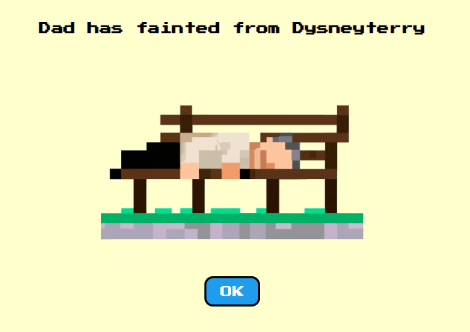

# The Orlando Trail

> It's like The Oregon Trail but in a theme park.

[Play the game](https://seesharpcode.github.io/the-orlando-trail/)

After selecting your occupation, party members, and gift shop items, you and your party must complete activities throughout the park before succumbing to the Florida heat and other hazards. Maintain each party member's magic meter and keep the children happy!

This game was made with React and custom CSS and is only intended for desktop browsers.

> The Orlando Trail is a WIP. Core gameplay is working, but some features are still in development:
>
> - Proper win condition(s)
> - Occupation and travel conditions influence gameplay
> - Wait scene for attractions
> - Validation in setup screens
> - Persistence
